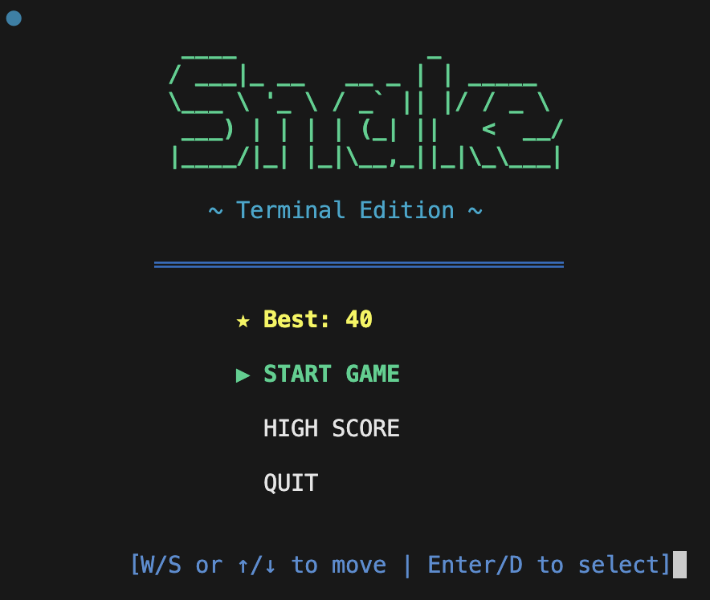
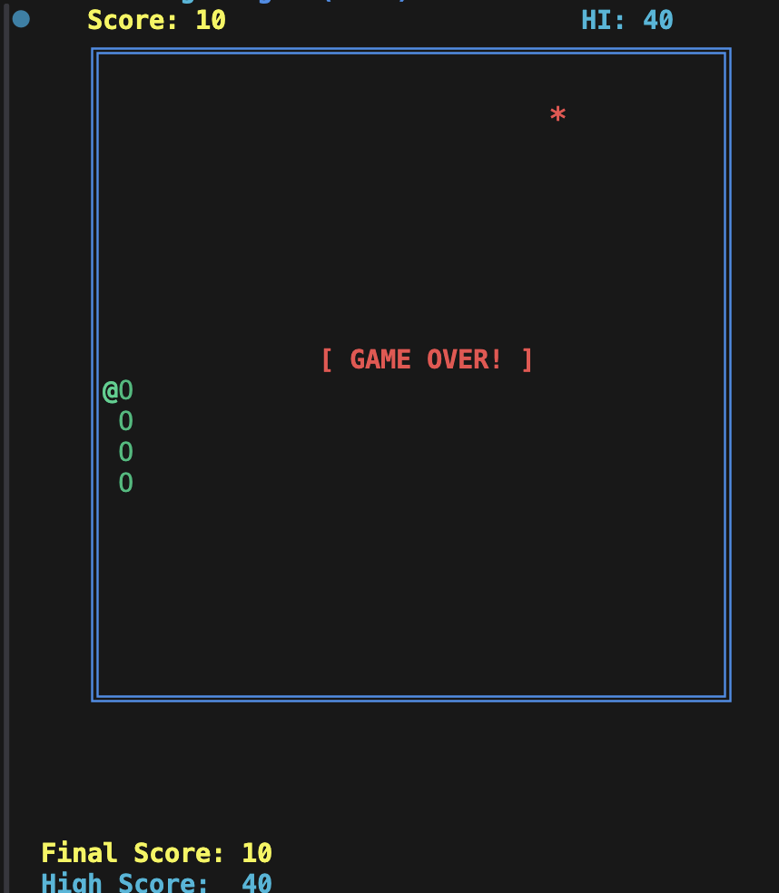

# 🐍 C-Snake: Low-Level Terminal Game

A performance-optimized Snake game written in C that demonstrates core systems programming concepts. Unlike standard implementations, this project avoids most standard library overhead by implementing custom memory management, terminal rendering, and non-blocking input handling — all from scratch.


---

## 📸 Screenshots

### Menu Dashboard
<p align="center">
  
</p>

### Gameplay
<p align="center">
  
</p>

---

## 🚀 Key Technical Features

- **Custom Memory Management**: Linked-List based Free-List allocator with block splitting and coalescing on a static 1MB heap.
- **ANSI Rendering Engine**: Raw ANSI escape sequences for flicker-free terminal rendering — no `ncurses` dependency.
- **Color & Unicode UI**: Full ANSI color support (16 colors) with Unicode box-drawing borders (`╔═╗║╚╝`).
- **Non-Blocking I/O**: Terminal `termios` configuration for immediate keypress capture without `Enter`.
- **Bitwise Math Module**: Custom `mul`, `div`, `mod`, `abs` using only shift-and-add / bitwise long division — no hardware multiply/divide.
- **Interactive Menu System**: ASCII art title screen with ▶ pointer navigation and high score display.
- **Persistent High Score**: File-based score persistence across game sessions.
- **Web Version**: Standalone browser-based Snake (Canvas + vanilla JS) included.

---

## 🛠️ Installation & Build

Ensure you have a C compiler (`gcc` or `clang`) installed.

1. **Clone the repository**:
   ```bash
   git clone https://github.com/SahilS2004/Snake-game.git
   cd Snake-game
   ```

2. **Compile the project**:
   ```bash
   make
   ```

3. **Run the game**:
   ```bash
   ./bin/snake
   ```

4. **Clean build artifacts**:
   ```bash
   make clean
   ```

---

## 🎮 Controls

| Key | Action |
|:----|:-------|
| **W** / **↑** | Move Up |
| **S** / **↓** | Move Down |
| **A** / **←** | Move Left |
| **D** / **→** | Move Right |
| **Enter** / **D** | Select menu option |
| **Q** | Quit game / menu |

---

## 📂 Project Structure

```
Snake-game/
├── include/            # Header files (.h)
│   ├── game.h          # Game state, types, and logic declarations
│   ├── highscore.h     # Persistent high score interface
│   ├── keyboard.h      # Non-blocking input interface
│   ├── math.h          # Bitwise math & PRNG declarations
│   ├── memory.h        # Custom memory allocator interface
│   ├── menu.h          # Menu dashboard interface
│   ├── screen.h        # ANSI rendering & color interface
│   └── string.h        # Custom string utility declarations
│
├── src/                # Source files (.c)
│   ├── main.c          # Entry point, menu loop, and game coordination
│   ├── game.c          # Core game logic, collision, rendering
│   ├── highscore.c     # File-based high score persistence
│   ├── keyboard.c      # Terminal raw-mode & input handling
│   ├── math.c          # Bitwise math & pseudo-random generator
│   ├── memory.c        # Linked-list heap allocator on static buffer
│   ├── menu.c          # ASCII art menu with pointer navigation
│   ├── screen.c        # ANSI escape-code renderer with color
│   └── string.c        # String manipulation & int-to-string
│
├── web/                # Browser-based version
│   └── index.html      # Canvas-based Snake (retro edition)
│
├── assets/             # Screenshots and media
│   ├── menu.png        # Menu dashboard screenshot
│   └── playground.png  # Gameplay screenshot
│
├── docs/               # Documentation & reports
│   ├── report.tex      # IEEE-format LaTeX source
│   └── report.pdf      # Compiled paper
│
├── bin/                # Compiled binary output (git-ignored)
├── Makefile            # Automated build system
├── .gitignore          # Build artifacts & OS files exclusion
└── README.md           # This file
```

---

## 🧠 Architectural Overview

### 1. Menu Dashboard
The game launches into an interactive menu rendered with ASCII art and Unicode decorations. A `▶` pointer navigates between options (Start Game, High Score, Quit) using W/S or arrow keys. The menu loop runs independently, polling non-blocking input at 50ms intervals.

### 2. Memory Management
A global array `ram[1024 * 1024]` simulates physical memory. The `alloc()` function implements a **First-Fit** strategy with block splitting. The `dealloc()` function performs **immediate coalescing**, merging adjacent free blocks to combat fragmentation. Every snake node is dynamically allocated and freed through this custom heap.

### 3. Terminal Rendering & Color
The screen module sends raw ANSI escape sequences for cursor positioning (`\033[y;xH`), screen clearing (`\033[H\033[J`), and color control (`\033[<code>m`). The game board uses Unicode box-drawing characters for walls (`╔═╗║╚╝`) with a 16-color palette:

| Element | Color |
|:--------|:------|
| Score | Bold Yellow |
| High Score | Bold Cyan |
| Walls | Bold Blue |
| Food (`*`) | Bright Red |
| Snake Head (`@`) | Bright Green |
| Snake Body (`O`) | Green |
| Game Over | Bold Red |

### 4. Input Handling
By setting the terminal to **Non-Canonical Mode** using `termios`, the application reads input bytes immediately. Arrow keys are decoded from their multi-byte ANSI escape sequences (`\033[A/B/C/D`) and mapped to WASD equivalents.

### 5. Math & PRNG
All arithmetic is implemented from scratch using **bitwise operations only**:
- **Multiplication**: Shift-and-add (Russian peasant algorithm)
- **Division/Modulo**: Bitwise long division (restoring method)
- **Absolute value**: Sign-bit mask with XOR
- **PRNG**: Linear Congruential Generator driven by the bitwise `mul` routine

### 6. High Score Persistence
The high score module reads/writes an integer to a local `.snake_highscore` file using standard file I/O. The score is loaded at game init and saved only when the player beats the existing record.

---

## 👥 Authors

- **Ayush Gupta** — [ayush.g23csai@nst.rishihood.edu.in](mailto:ayush.g23csai@nst.rishihood.edu.in)
- **Sahil Sarawgi** — [sahil.s23csai@nst.rishihood.edu.in](mailto:sahil.s23csai@nst.rishihood.edu.in)

*Department of CS and AI, Newton School of Technology*

---

Developed as a demonstration of low-level C programming and systems design.
